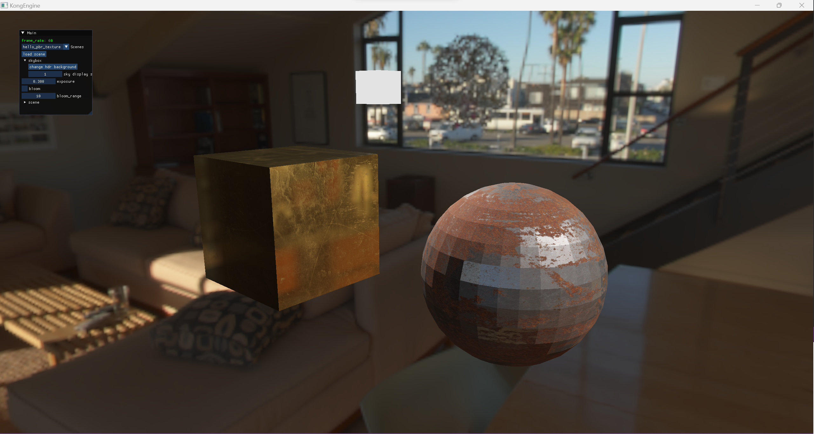
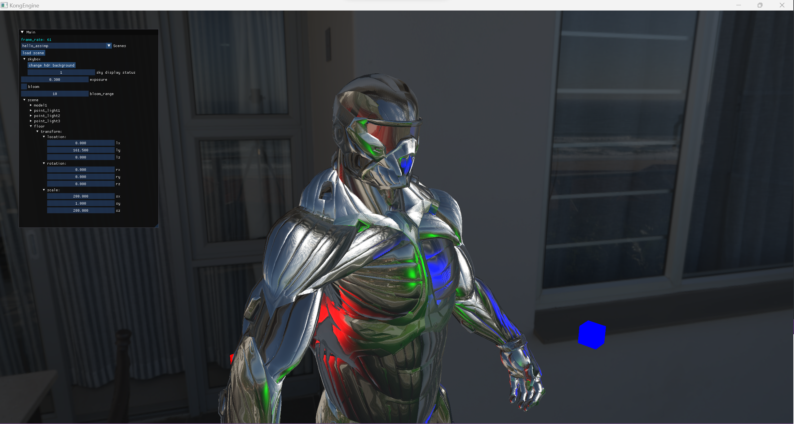

# 关于KongEngine

这个工程是我用于学习和实践引擎技术的项目。原名是tinyGL，是一个功能较为基础的渲染引擎，现在计划是将他的能力扩展，接入更加先进多样的功能。

目前包括以下几个部分：
- 渲染：kong engine，主入口，提供渲染能力。目前基于OpenGL接口，使用PBR的渲染框架实现真是的渲染效果。
- 物理：tap engine，物理模拟能力的库。自己编写实现，作为组建提供真实的物理效果。

场景的描述目前基于yaml和json实现，后面应该更加倾向于仅支持yaml。

UI基于[ImGui](https://github.com/ocornut/imgui)

# 构建
*原msvc文件下的sln已经废弃不再使用*

项目使用cmake进行构建，在工程主目录下，运行build.bat文件（目前只支持Windows），会在**project_build**目录下生成对应的sln工程，编译KongEngine运行即可。

# 现有能力和后续规划:
## 渲染能力
### 算法
 - [x] PBR(BRDF)基础能力实现
 - [x] 法线贴图
 - [ ] 阴影
    - [x] 平行光源阴影
    - [x] 点光源阴影
    - [ ] 阴影效果优化
    - [ ] CSM
 - [x] 材质贴图
 - [ ] **目标**： 光线追踪接入
 - [x] SkyMap
 - [x] IBL
 - [x] 实例化渲染
 - [ ] 多种抗锯齿能力
 - [x] 后处理能力
   - [x] 帧缓冲
   - [x] 黑白
   - [x] 核效果
   - [ ] 后处理效果整合(多种排列组合、参数暴露)
 - [ ] 全局光照
 - [ ] 环境光遮蔽
 - [ ] 大场景渲染
   - [ ] 地形
   - [x] 天空大气
   - [ ] 水体
   - [ ] 云层

## 编辑能力
 - [x] 基础UI
 - [x] 场景加载
 - [ ] 场景世界线框/object坐标轴
 - [ ] 场景修改
    - [ ] 增加/删除Object
    - [x] 移动/旋转/缩放Object
 - [ ] 场景序列化/反序列化
    - [x] 场景序列化(JSON)加载
    - [x] 场景序列化(YAML)加载
    - [ ] 场景反序列化

## 引擎能力
 - [x] Assimp库支持
 - [x] CMake编译支持
 - [x] 支持组件设计
 - [ ] 支持Tap物理引擎

