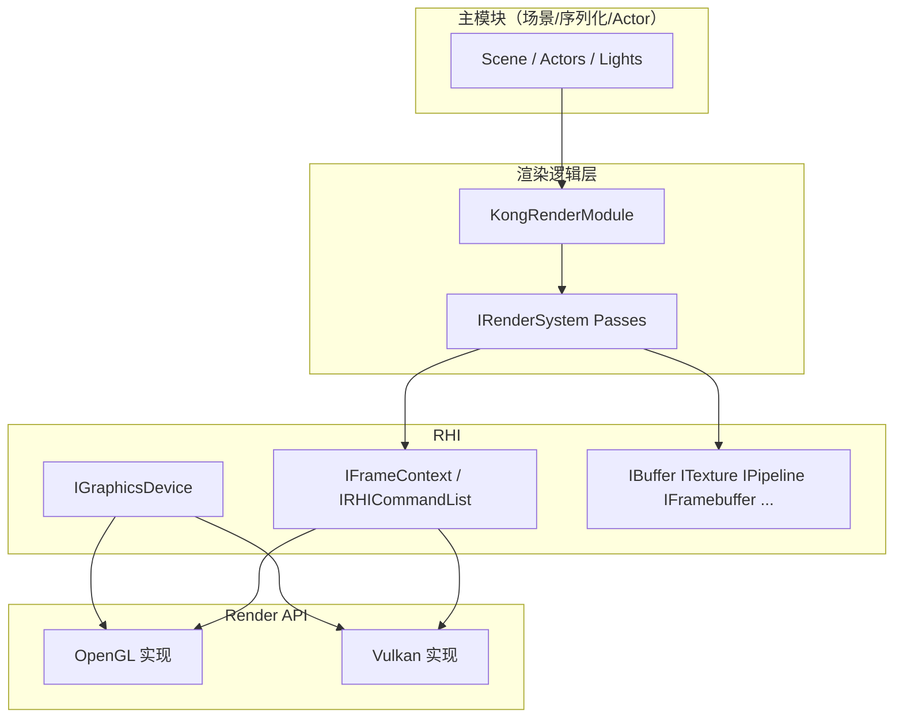

# 渲染四层架构：渲染逻辑层、RHI、Render API 职责梳理

本文档与仓库内 `tinyGL/src/Render/Abstraction/*`、`Render/Logic/RenderPassCatalog.hpp` 对齐，描述**主模块（场景/编辑器）之下**的三层渲染划分：**渲染逻辑层 → RHI → Render API（OpenGL / Vulkan）**。

---

## 1. 渲染逻辑层（Render Logic Layer）

### 1.1 定位

- **输入**：主模块提供的场景描述（Actor、Mesh、Light、Camera、材质/Shader 元数据等），以及每帧的 `SceneDrawInfo`（帧索引、时间、当前颜色/深度 RT 句柄等）。
- **职责**：按固定顺序编排 **Shadow → GBuffer（延迟几何）→ 光照解析（Deferred Lighting）→ Skybox → 前向/特殊物体（水、SSR 等）→ 后处理 → UI**，不直接调用 `gl*` / `vk*`。
- **载体**：`KongRenderModule` 持有 `std::vector<std::unique_ptr<IRenderSystem>>`，每个 `IRenderSystem` 对应一个逻辑 Pass；`IRenderModuleBackend` 仅负责**注册**这些 Pass 的**实现**（迁移期仍可能通过 `RenderSystemAdapter` 调用旧 `Gl*`/`Vk*` 系统，最终应改为 Pass 内只使用 RHI）。

### 1.2 与当前代码的对应关系

| 逻辑单元 | 现有 OpenGL | 现有 Vulkan | 目标形态 |
|----------|-------------|--------------|----------|
| 阴影 | 各 Light 组件 + `RenderShadowMap` | Backend 内 Pass | `IRenderSystem`：`ShadowPass`，只通过 RHI 写 depth map |
| 延迟几何（GBuffer） | `GlDeferRenderSystem`（MRT） | Backend 对应 Pass | `DeferredGeometryPass`：绑定 GBuffer `IFramebuffer`，绘制场景子集 |
| 延迟光照 | 同上系统内解析 | 同上 | `DeferredLightingPass`：全屏或光照几何，读 GBuffer 纹理 |
| 天空盒 | `GlSkyboxRenderSystem` | Backend Pass | `SkyboxPass`：深度测试策略、立方体贴图由 RHI 绑定 |
| 后处理 | `GlPostProcessRenderSystem` | Backend Pass | `PostProcessPass`：链式 RT，每步为 fullscreen + `IPipeline` |
| SSR / 水等 | `GlSSReflectionRenderSystem`、`GlWaterRenderSystem` | 对应 | 可选子 Pass，仍实现 `IRenderSystem` |

### 1.3 推荐依赖方向

- 逻辑 Pass **禁止** include 任何 `OpenGL*` / `Vulkan*` / `glad` / `vulkan.h`（迁移完成后应用 Linter/CI 约束）。
- **共享数据**（如全局矩阵、光照 UBO）：由 `KongRenderModule` 或独立 `SceneRenderResources` 持有 `IBuffer*`，Pass 只通过 RHI 绑定与更新。

### 1.4 Pass 顺序编目

见 `tinyGL/src/Render/Logic/RenderPassCatalog.hpp` 中 `RenderLogicPassId` 与默认拓扑注释；实际顺序以 `IRenderModuleBackend::Init` 中 `PushRenderSystem` 为准。

---

## 2. RHI 层：提供给渲染逻辑层的接口

RHI 是**稳定边界**：渲染逻辑层只依赖下列抽象（头文件位于 `Render/Abstraction/`）。

### 2.1 设备与帧

| 接口 | 用途 |
|------|------|
| `IGraphicsDevice` | 初始化、创建资源、`BeginFrame` / `EndFrame` / `WaitIdle` |
| `IFrameContext` | 当前帧语义边界；`GetFrameIndex`；兼容期 `GetCurrentCommandList()`（Vulkan 原生指针） |
| `IRHICommandList`（新） | **录制/执行**绘制指令：视口、裁剪、清除、绑定 FBO/管线、VB/IB、绘制、纹理与 Uniform 缓冲绑定、资源屏障（Vulkan） |

### 2.2 资源

| 接口 | 用途 |
|------|------|
| `IBuffer` | 顶点/索引/Uniform/Staging，`Upload`、`Bind(slot, commandList)` |
| `ITexture` | 颜色/深度/立方体等，`Bind`、`TransitionLayout`（Vulkan） |
| `ISampler`（新） | 与纹理分离的采样状态（Vulkan 必需概念；OpenGL 可与纹理合并实现） |
| `IPipeline` | 着色器阶段 + 固定功能状态的已编译绑定单元 |
| `IRenderPass` | Load/Store + 附件兼容描述（与 `RenderPassDesc` 扩展配套） |
| `IFramebuffer` | 多颜色附件 + 深度模板附件 |
| `IDescriptorSet` | 可选：批量绑定 UBO/纹理（Vulkan descriptor；OpenGL 可映射到 uniform 槽） |

### 2.3 类型与描述符

| 类型 | 用途 |
|------|------|
| `Types.hpp`：`BufferDesc`、`TextureDesc`、`PipelineDesc`、`RenderPassDesc`、`SceneDrawInfo` | 无 GL/Vk 类型的创建参数 |
| `BackendType` | 运行时后端枚举 |
| `RenderLogicPassId` | 逻辑 Pass 标识（与 API 无关） |

### 2.4 渲染逻辑层典型调用序列（单 Pass 内）

1. `auto& frame = device.BeginFrame();`
2. `IRHICommandList* cmd = frame.GetRHICommandList();`（无则走即时 GL 兼容路径或后续由 `OpenGLCommandList` 封装）
3. `cmd->SetViewport` / `SetScissor` → `BindFramebuffer` 或 `BeginRenderPass` → `BindPipeline` → 绑定 VB/IB/描述符 → `Draw` / `DrawIndexed`
4. 需要跨 Pass 同步时：`ITexture::TransitionLayout` 或 `cmd->ResourceBarrier`（扩展位）

---

## 3. Render API 层：为实现 RHI 需提供的能力

Render API **实现**上述接口，不暴露给渲染逻辑层。

### 3.1 对 `IGraphicsDevice` 的实现义务

- **OpenGL**：`Init` 创建上下文；`CreateBuffer` / `CreateTexture` / `CreateSampler` / `CreatePipeline` / `CreateRenderPass` / `CreateFramebuffer` 映射到 GL 对象；`BeginFrame`/`EndFrame` 与交换缓冲、可选调试标记对齐。
- **Vulkan**：实例、设备、队列、交换链、命令池/缓冲、同步对象；资源创建与 `vk*` 一一对应；`BeginFrame` acquire + begin CB，`EndFrame` submit + present。

### 3.2 对 `IFrameContext` / `IRHICommandList` 的实现义务

- **OpenGL**：`GetCurrentCommandList` 可继续为 `nullptr`；`IRHICommandList` 可实现为**即时模式封装**（内部直接 `gl*`），保证逻辑层 API 统一。
- **Vulkan**：`GetCurrentCommandList` 可保留为 `VkCommandBuffer*`；`IRHICommandList` 实现应**只**写入当前帧 command buffer，并在 Pass 边界插入 `pipeline barrier` / `render pass`。

### 3.3 资源与管线映射表（实现侧检查清单）

| RHI 抽象 | OpenGL 实现要点 | Vulkan 实现要点 |
|----------|-----------------|-----------------|
| `IBuffer` | `GLuint` VBO/IBO/UBO，`glBindBuffer` / DSA | `VkBuffer` + memory，descriptor 或 `vkCmdBindVertexBuffers` |
| `ITexture` | `GLuint` texture，`glBindTextureUnit` | `VkImage`、view、sampler、layout 迁移 |
| `ISampler` | 可合并进纹理或独立 `sampler object`（若扩展） | `VkSampler` |
| `IPipeline` | `glUseProgram` + VAO + 部分全局状态 | `VkPipeline` + `VkPipelineLayout` |
| `IRenderPass` | `glBindFramebuffer` + `glDrawBuffers` + 清除 | `VkRenderPass` |
| `IFramebuffer` | FBO + 附着 | `VkFramebuffer` |
| `IDescriptorSet` | uniform 位置缓存 | `VkDescriptorSet` |

### 3.4 `IRenderModuleBackend` 的角色（迁移期）

- 负责把**后端特有的** Pass 实现注册进 `KongRenderModule`（例如仍调用 `GlDeferRenderSystem::Draw`）。
- 长期目标：Backend 只做「创建 RHI 资源 + 注册纯 RHI 的 `IRenderSystem`」，与「Render API」文件物理上可同目录，但**逻辑上**仍属「工厂/组装」，与「逻辑 Pass 算法」分离。

---

## 4. 与现有 `KongRenderModule` 的渐进剥离项

以下项仍耦合 OpenGL，迁移时按序收口：

- `UBOHelper`、`GLuint m_renderToBuffer` / `m_renderToTextures` → 改为 `IBuffer` + `IFramebuffer`（RHI）。
- `RenderResultInfo` 中的 `GLuint` → `ITexture*` 或 RHI 句柄类型。
- `RenderNonDeferSceneObjects` 内 `gl*` / `OpenGLShader` → 逻辑层通过 `IPipeline` + `IRHICommandList` 绘制。

---

## 5. 代码索引

| 路径 | 说明 |
|------|------|
| `Render/Abstraction/IGraphicsDevice.hpp` | 设备与资源创建入口 |
| `Render/Abstraction/IFrameContext.hpp` | 帧上下文 + `GetRHICommandList()` |
| `Render/Abstraction/IRHICommandList.hpp` | 绘制与绑定命令（逻辑层主入口） |
| `Render/Abstraction/Types.hpp` | 描述符与 `SamplerDesc`、清除掩码、图元类型等 |
| `Render/Abstraction/ISampler.hpp` | 采样器对象 |
| `Render/Logic/RenderPassCatalog.hpp` | 逻辑 Pass 编目与顺序约定 |
